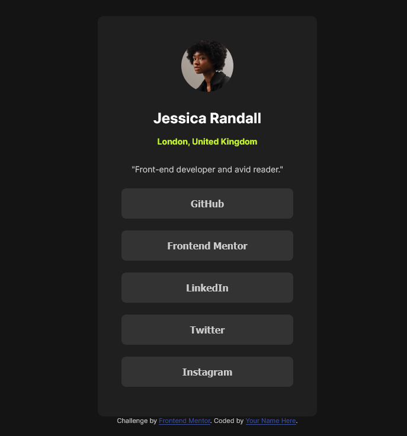

# Frontend Mentor - Social links profile solution

This is a solution to the [Social links profile challenge on Frontend Mentor](https://www.frontendmentor.io/challenges/social-links-profile-UG32l9m6dQ). Frontend Mentor challenges help you improve your coding skills by building realistic projects. 

## Table of contents

- [Overview](#overview)
  - [The challenge](#the-challenge)
  - [Screenshot](#screenshot)
  - [Links](#links)
- [My process](#my-process)
  - [Built with](#built-with)
  - [Useful resources](#useful-resources)
- [Author](#author)

## Overview

### The challenge

Users should be able to:

- See hover and focus states for all interactive elements on the page

### Screenshot

### Links

- Solution URL: [Code in Github](https://github.com/jprush76/frontend-mentor-03-social-links-profile)
- Live Site URL: [Review solution here](https://jprush76.github.io/frontend-mentor-03-social-links-profile/)

## My process

### Built with

- Semantic HTML5 markup
- Flexbox

### Useful resources

- [Flexbox Guide](https://css-tricks.com/snippets/css/a-guide-to-flexbox/) - Every time I need to use flexbox, I open this guide.

## Author

- Website - _Don't have a website yet. I'm working on it._
- Frontend Mentor - [@jprush76](https://www.frontendmentor.io/profile/jprush76)
- Twitter - [@JaimePastrian](https://www.twitter.com/JaimePastrian)
